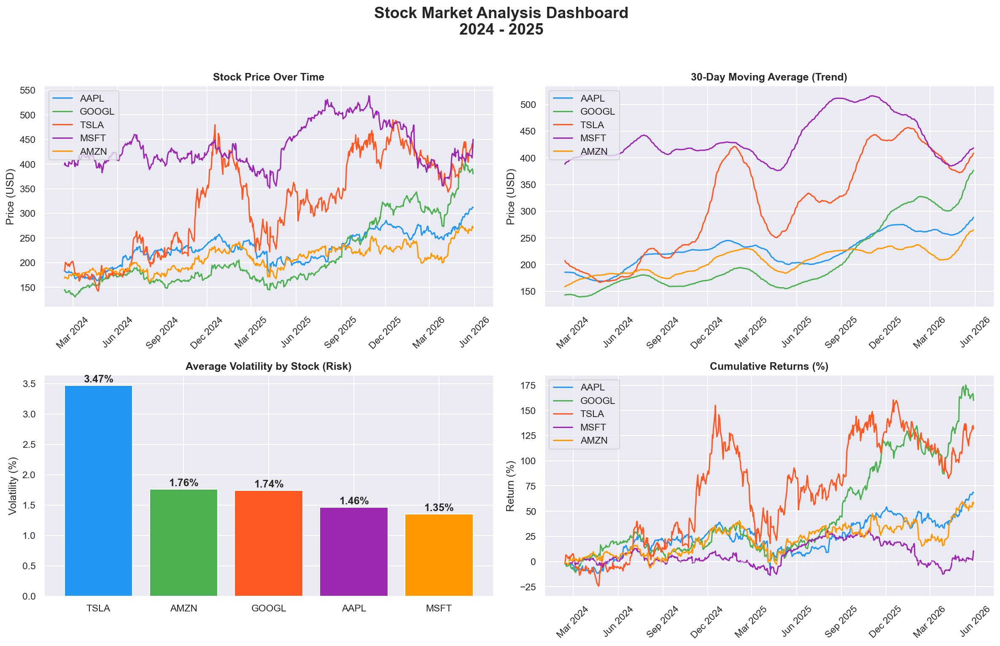

# Finance Data Pipeline 📈

## Overview
An automated end-to-end stock market analysis pipeline that extracts 
real financial data, transforms it into meaningful insights, loads it 
into SQL Server, and visualizes it in a professional dashboard.

## What It Does

- Pulls real stock market data for AAPL, GOOGL, TSLA, MSFT and AMZN
- Cleans and transforms raw data into financial metrics
- Stores data in Microsoft SQL Server
- Generates a professional dashboard with 4 charts

## Tech Stack

- **Python** — core language
- **yfinance** — pulls real stock data from Yahoo Finance
- **Pandas** — data cleaning and transformation
- **SQLAlchemy + PyODBC** — database connection
- **Microsoft SQL Server** — data storage
- **Matplotlib + Seaborn** — data visualization

## Pipeline Architecture

Yahoo Finance → extract.py → transform.py → load.py → SQL Server
↓
visualize.py
↓
Dashboard PNG

## Financial Metrics Calculated
| Metric | Description |
|--------|-------------|
| Daily Return | % price change per day |
| 7 Day Moving Average | Short term price trend |
| 30 Day Moving Average | Long term price trend |
| Volatility | Risk indicator per stock |

## Dashboard Preview


## How To Run

### 1. Install dependencies
```bash
pip install yfinance pandas sqlalchemy pyodbc matplotlib seaborn
```

### 2. Run the pipeline
```bash
cd scripts
python extract.py
python transform.py
python load.py
python visualize.py
```

## Results
| Stock | Avg Price | Avg Daily Return | Avg Volatility |
|-------|-----------|-----------------|----------------|
| MSFT  | $435.53   | 0.029%          | 1.35           |
| TSLA  | $317.70   | 0.217%          | 3.47           |
| AAPL  | $228.84   | 0.105%          | 1.46           |
| GOOGL | $214.55   | 0.184%          | 1.74           |
| AMZN  | $209.16   | 0.097%          | 1.76           |

## Author
Vhugala — Data Engineer | BI Engineer | Data Analyst
📧 tshishongavhugala@gmail.com
🔗 www.linkedin.com/in/vhugala-tshishonga